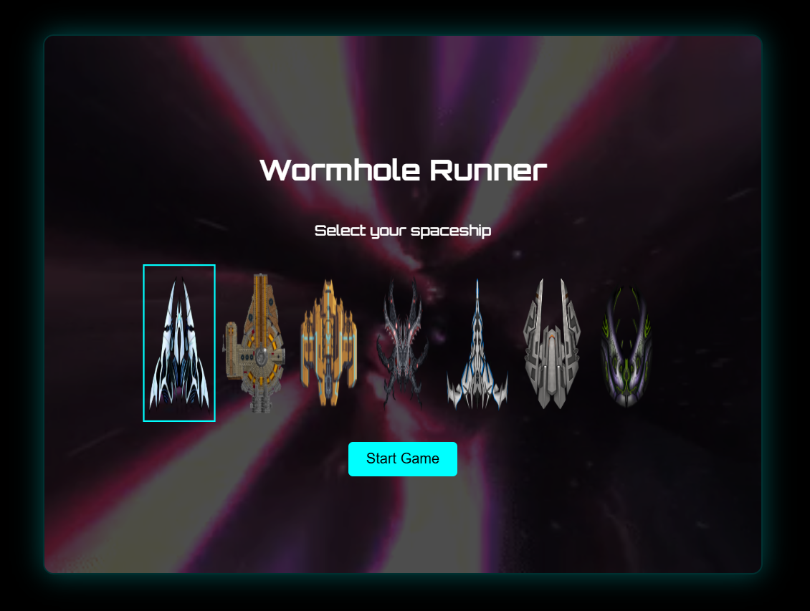
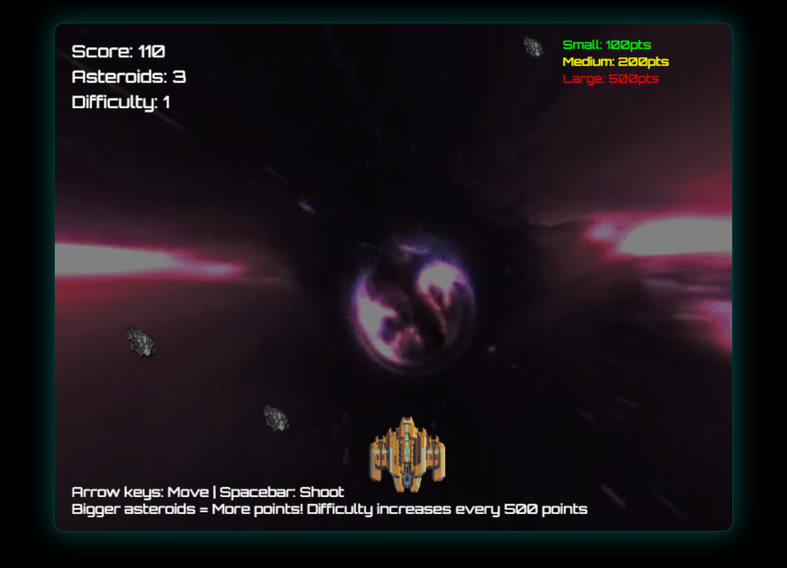

# 🌌 Wormhole Runner

**Wormhole Runner** is a basic JavaScript browser game where you guide a spaceship through a starry wormhole while avoiding randomly placed asteroids. It's a beginner-friendly project built using only HTML, CSS, and vanilla JavaScript — a fun and simple way to practice game loops, DOM manipulation, and basic interactivity.

---

## 🔗 Play the Game

**[Click here to play Wormhole Runner!](https://cryosleeperX20.github.io/Wormhole-Runner/)**  
Live demo hosted using GitHub Pages.

## 🎮 Features

- 🚀 Move your spaceship using arrow keys
- ☄️ Avoid asteroid collisions
- 🌠 Starry animated background
- 🔊 Basic background music (toggle in code)
- 📷 Screenshots included for quick preview
- 🧠 Clean structure for easy understanding

---

## 📸 Screenshots

---

## 🛠 Tech Stack

- **HTML5** – structure and layout  
- **CSS3** – styling and simple animation  
- **JavaScript (vanilla)** – game logic and interactivity

--
